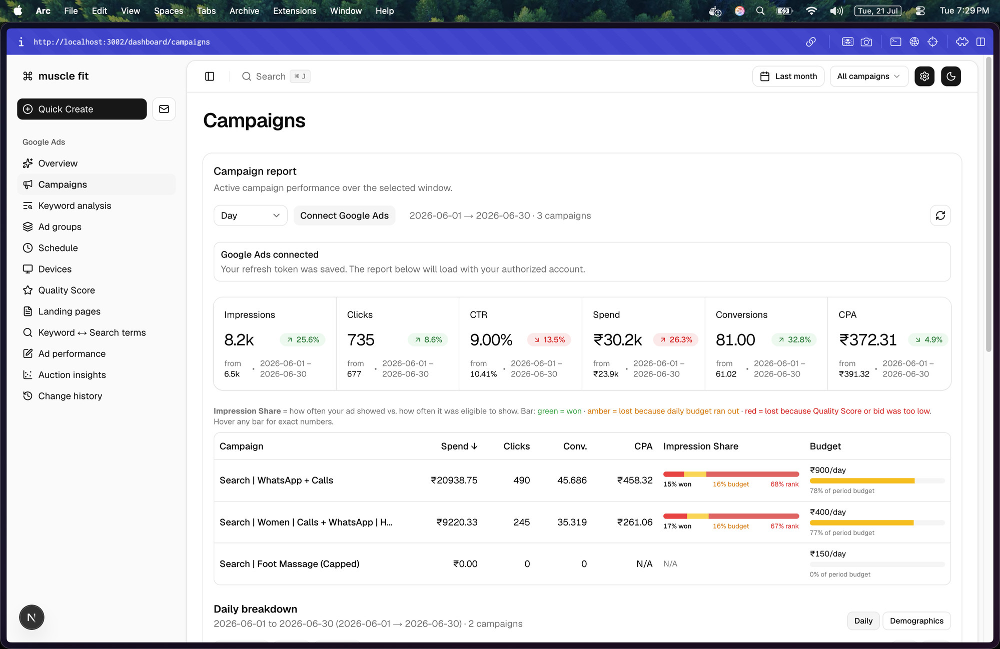

# Google Ads API — Basic Access Design Documentation

**Company Name:** Intune Wellness Private Limited

**Business Model:** Intune Wellness Private Limited operates **muscle fit**, a massage and wellness studio in Bengaluru, India, with a single website, musclefitspa.com. We run Google Ads Search campaigns exclusively to advertise our own studio and services — we do not manage ads for any other business, client, or website.

**Tool Access/Use:** Our tool is used internally by the business owner and marketer managing this single Google Ads account. It's a private, non-public reporting dashboard plus a set of internal CLI/analysis scripts — there is no external agency, client, or third party with access to the tool itself. It is not used to generate reports for distribution outside the company.

We do not run any automated ad-modification scripts (no scheduled syncing, bulk uploads, or automated pausing) — all campaign, budget, and keyword changes are made manually by the account owner through the Google Ads UI. The tool is read-only against the Google Ads API.

**Tool Design:** The tool is a Next.js web dashboard plus standalone Node.js CLI scripts, both built on the `google-ads-api` client library. On request (dashboard page load, or a manual CLI run), the tool queries the Google Ads API directly via GAQL (Google Ads Query Language) and renders the results in the UI or terminal. An optional Redis cache-aside layer (1-hour TTL) reduces repeated identical API calls during a session; there is no persistent database of Google Ads data — each report reflects a fresh (or briefly cached) pull from the API.

**API Services Called:**

- `GoogleAdsService.SearchStream` (via GAQL) against the following resources:
  - `campaign` — campaign performance summaries, budgets, daily/weekly/monthly breakdowns
  - `ad_group` — ad group-level performance
  - `ad_group_ad` — ad-level performance, RSA ad strength
  - `ad_group_ad_asset_view` — per-asset (headline/description) performance labels
  - `ad_group_criterion` — keyword-level data, Quality Score, match types, bids
  - `campaign_criterion` — campaign-level keywords and negatives
  - `keyword_view` — keyword performance metrics
  - `search_term_view` — search terms report, keyword ↔ search term mapping
  - `landing_page_view` — landing page performance by destination URL
  - `change_event` — account change history (audit trail)
- **Auction Insights** (via `segments.auction_insight_domain` on `keyword_view`) — this is the specific capability we are requesting access to unlock; it is currently disabled on our developer token, returning: *"Auction insight metrics are not enabled for this Google Ads developer token."*

**Tool Mockups:** Our tool is **not externally accessible** — it runs as an internally-hosted dashboard used only by the account owner, with no public URL. Per the note above, we understand mockups/screenshots are primarily required for externally accessible tools, but include one below for reference.

Below is a screenshot of the Campaigns page of our internal dashboard, showing account-level performance metrics (impressions, clicks, CTR, spend, conversions, CPA) and a per-campaign breakdown with Impression Share and budget utilization:

